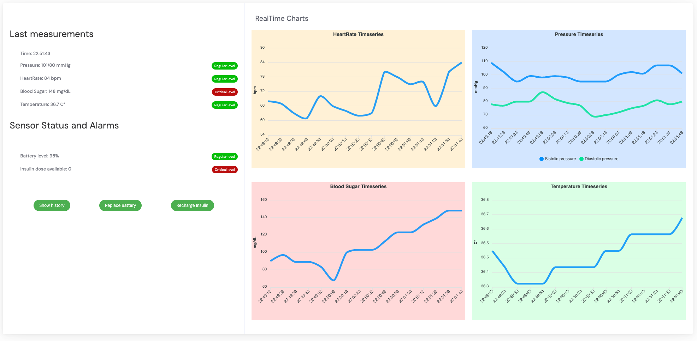
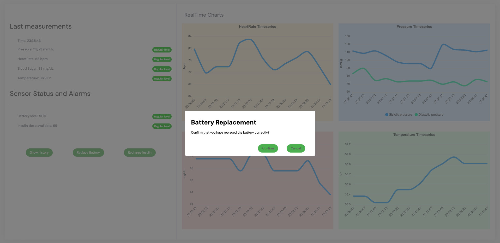
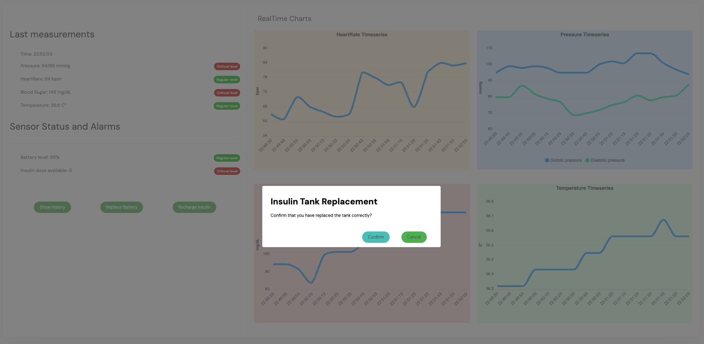
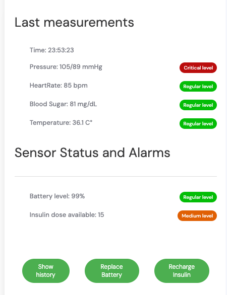
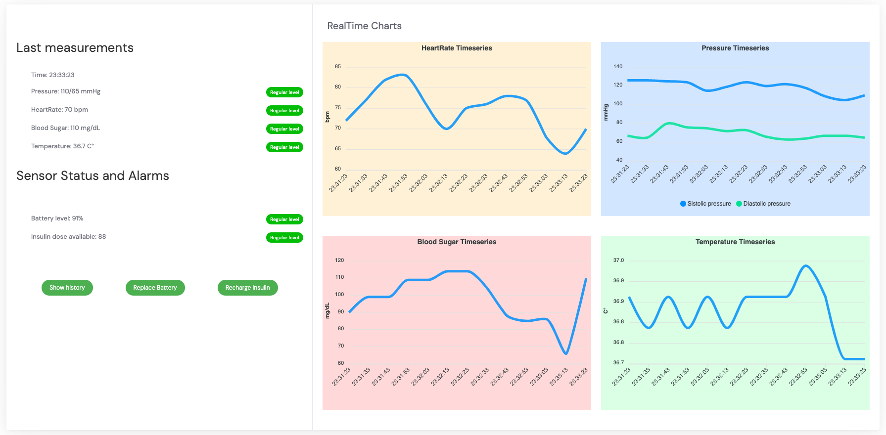
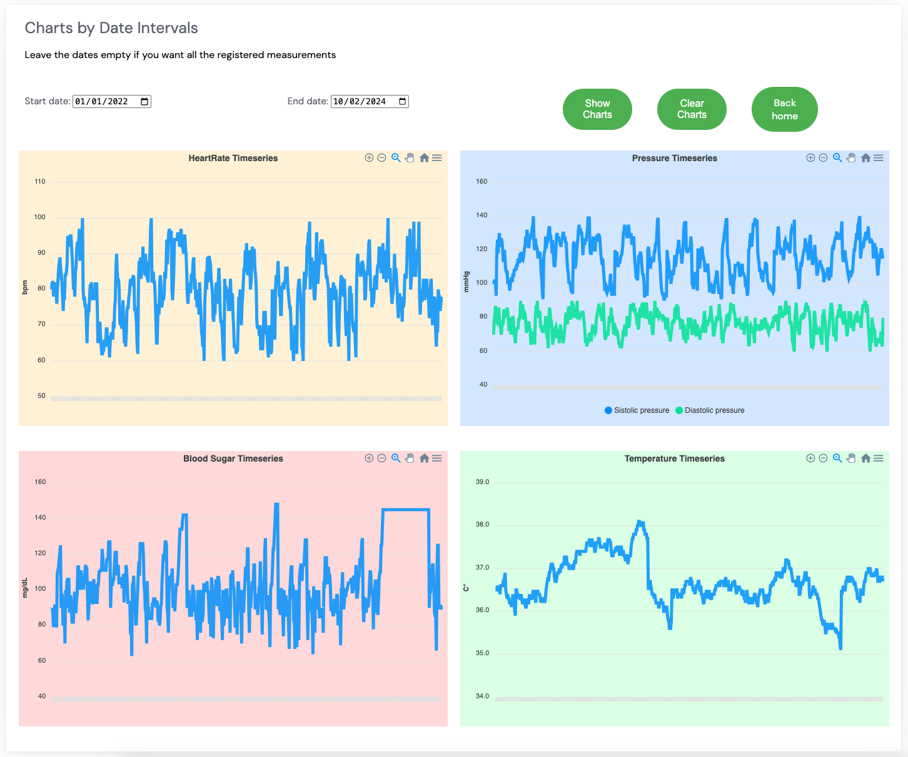
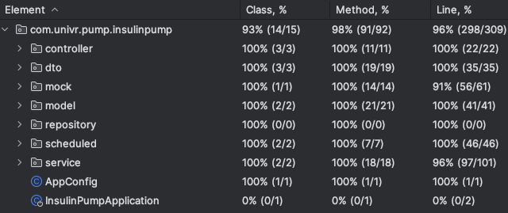
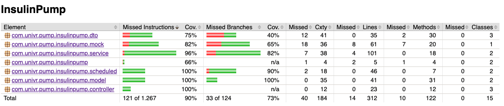

# 💉🩸Pompa di Insulina 🩸💉
> Progetto per il corso di Ingegneria del Software 
> dell'Università degli Studi di Verona.

Il sistema software è stato sviluppato per la gestione di
una pompa di insulina. Il sistema è in grado di monitorare
i parametri vitali del paziente e di erogare insulina in caso
di necessità, fornendo inoltre un'interfaccia grafica per
l'analisi dei dati.

## Indice
1. [🗳️ Scaricare il progetto](#scaricare-il-progetto)
2. [📈 Scenari](#scenari)
3. [📚 Documentazione API relative ai sensori](#documentazione-api-relative-ai-sensori)
4. [📚 Documentazione API Parametri Vitali](#documentazione-api-parametri-vitali)
5. [🧪 Test](#test)
6. [👨‍💻 Autori](#autori)

---


## <a id="scaricare-il-progetto"></a> Scaricare il progetto
Per scaricare il progetto è necessario clonare la repository
tramite il comando `git clone https://github.com/nickkpiccoli/Insulin-pump.git`.
Dopodiché è necessario eseguire il comando `./gradlew build` per
scaricare le dipendenze e compilare il progetto. Per eseguire
il progetto è necessario eseguire il comando `./gradlew bootRun`, 
che avvierà il server sulla porta `8080`.

---
## <a id="scenari"></a> Scenari

### 📉 Livello di glucosio in diminuzione `(r2 < r1)`

- **Assunzione iniziale**: Un utente porta con se un dispositivo che misura i parametri
vitali del paziente. Il dispositivo è in grado di misurare la pressione sanguigna,
la frequenza cardiaca, la temperatura corporea e il livello di zucchero nel sangue.
Il dispositivo è in grado di inviare i dati al server tramite una connessione internet.
La batteria del dispositivo è carica e contiene abbastanza insulita per processare eventuali
richieste. Si assume che i dati ricevuti dal dispositivo siano corretti e che il dispositivo
non invii dati errati e che il livello di insulina sia inferiore a 130.
- **Funzionamento**: Il dispositivo invia i dati al server. Il server riceve i dati e li salva
nel database. Il sistema verifica se i dati relativi al glucosio non siano fuori dai limiti
accettabili. Se il livello di glucosio sta decrementando nel tempo, l'erogazione di insulina
non avviene.
- **Cosa può andare storto**: La batteria della pompa di insulina si scarica. In questo caso 
i parametri vitali del paziente non vengono più monitorati e non è possibile erogare insulina.
In questo caso si assume che nel tempo continuino a variare, portando quindi il livello di insulina 
fuori dai limiti accettabili. In questo caso il sistema non è in grado di erogare insulina.

---

### 🧘 Livello di glucosio stabile `(r2 = r1)`

- **Assunzione iniziale**: Un utente porta con se un dispositivo che misura i parametri
  vitali del paziente. Il dispositivo è in grado di misurare la pressione sanguigna,
  la frequenza cardiaca, la temperatura corporea e il livello di zucchero nel sangue.
  Il dispositivo è in grado di inviare i dati al server tramite una connessione internet.
  La batteria del dispositivo è carica e contiene abbastanza insulita per processare eventuali
  richieste. Si assume che i dati ricevuti dal dispositivo siano corretti e che il dispositivo
  non invii dati errati e che il livello di insulina sia inferiore a 130.
- **Funzionamento**: Il dispositivo invia i dati al server. Il server riceve i dati e li salva
  nel database. Il sistema verifica se i dati relativi al glucosio non siano fuori dai limiti
  accettabili. Se il livello di glucosio è stabile nel tempo, l'erogazione di insulina
  non avviene.
- **Cosa può andare storto**: La batteria della pompa di insulina si scarica. In questo caso
  i parametri vitali del paziente non vengono più monitorati e non è possibile erogare insulina.
  In questo caso si assume che nel tempo continuino a variare, portando quindi il livello di insulina
  fuori dai limiti accettabili. In questo caso il sistema non è in grado di erogare insulina.

---

### 📈 Livello di glucosio in aumento `((r2 – r1) ≥ (r1 – r0))` e il risultato è diverso da `0`
- **Assunzione iniziale**: Un utente porta con se un dispositivo che misura i parametri
  vitali del paziente. Il dispositivo è in grado di misurare la pressione sanguigna,
  la frequenza cardiaca, la temperatura corporea e il livello di zucchero nel sangue.
  Il dispositivo è in grado di inviare i dati al server tramite una connessione internet.
  La batteria del dispositivo è carica e contiene abbastanza insulita per processare eventuali
  richieste. Si assume che i dati ricevuti dal dispositivo siano corretti e che il dispositivo
  non invii dati errati e che il livello di insulina sia inferiore a 130.
- **Funzionamento**: Il dispositivo invia i dati al server. Il server riceve i dati e li salva
  nel database. Il sistema verifica se i dati relativi al glucosio non siano fuori dai limiti
  accettabili. Se il livello di glucosio è in aumento nel tempo, l'erogazione di insulina
  avviene per abbassare il livello di glucosio del paziente e portarlo entro i limiti accettabili
  secondo il seguente calcolo:
  - `se l'ultima misurazione - prima misurazione è maggiore o uguale alla differenza tra la
    prima e la seconda misurazione`
  - `La dose di compnsazione è calcolata come la differenza tra la prima e la seconda misurazione diviso 4`
  - `Se la dose di compensazione è un valore minore di 1 e maggiore di 0, la dose di compensazione è 1`
  - `Se la dose di compensazione è un valore maggiore di 1, la dose di compensazione è il valore arrotondato
    all'intero più vicino`

---

### 📈 Livello di glucosio in aumento `((r2 – r1) ≥ (r1 – r0))` e il risultato è uguale da `0`

- **Assunzione iniziale**: Un utente porta con se un dispositivo che misura i parametri
  vitali del paziente. Il dispositivo è in grado di misurare la pressione sanguigna,
  la frequenza cardiaca, la temperatura corporea e il livello di zucchero nel sangue.
  Il dispositivo è in grado di inviare i dati al server tramite una connessione internet.
  La batteria del dispositivo è carica e contiene abbastanza insulita per processare eventuali
  richieste. Si assume che i dati ricevuti dal dispositivo siano corretti e che il dispositivo
  non invii dati errati e che il livello di insulina sia inferiore a 130.
- **Funzionamento**: Il dispositivo invia i dati al server. Il server riceve i dati e li salva
  nel database. Il sistema verifica se i dati relativi al glucosio non siano fuori dai limiti
  accettabili. Se il livello di glucosio è in aumento nel tempo, l'erogazione di insulina
  avviene per abbassare il livello di glucosio del paziente e portarlo entro i limiti accettabili
  secondo il seguente calcolo:
  - `se l'ultima misurazione - prima misurazione è maggiore o uguale alla differenza tra la
    prima e la seconda misurazione`
  - `La dose di compnsazione è calcolata come la differenza tra la prima e la seconda misurazione diviso 4`
  - `Se la dose di compensazione è 0, la dose di compensazione sarà la dose minima, ovvero 1`

---

### 🚨 Livello di glucosio fuori dai limiti accettabili `livello glucosio ≥ 130`

- **Assunzione iniziale**: Un utente porta con se un dispositivo che misura i parametri
  vitali del paziente. Il dispositivo è in grado di misurare la pressione sanguigna,
  la frequenza cardiaca, la temperatura corporea e il livello di zucchero nel sangue.
  Il dispositivo è in grado di inviare i dati al server tramite una connessione internet.
  La batteria del dispositivo è carica e contiene abbastanza insulita per processare eventuali
  richieste. Si assume che i dati ricevuti dal dispositivo siano corretti e che il dispositivo
  non invii dati errati e che il livello di insulina sia maggiore o uguale a 130.
- **Funzionamento**: Il dispositivo invia i dati al server. Il server riceve i dati e li salva
  nel database. Il sistema verifica se i dati relativi al glucosio non siano fuori dai limiti
  accettabili. Se il livello di glucosio è fuori dai limiti accettabili, in qualunque situazione,
  la pompa erogherà insulina per abbassare il livello di glucosio del paziente e portarlo entro
  i limiti accettabili.
- **Cosa può andare storto**: La batteria della pompa di insulina si scarica. In questo caso
    i parametri vitali del paziente non vengono più monitorati e non è possibile erogare insulina.
    In questo caso si assume che nel tempo continuino a variare, portando quindi il livello di insulina
    fuori dai limiti accettabili. In questo caso il sistema non è in grado di erogare insulina.

<div align="center">
  
</div>

---

### 🔋 Malfunzionamento della Pompa di Insulina per Batteria Scarica

- **Assunzione Iniziale:**
Il sistema, che normalmente esegue misurazioni periodiche dei parametri vitali
del paziente, è inattivo a causa della batteria scarica della pompa di insulina.

- **Funzionamento Anomalo:**
A causa della batteria scarica, il sistema non può effettuare le misurazioni periodiche
dei parametri vitali e, di conseguenza, non può erogare insulina.

- **Soluzione:**
Per simulare la sostituzione della batteria della pompa di insulina, cliccare sul pulsante
`Replace Battery` nella pagina principale.

- **Feedback Utente:**
  Il sistema mostra la label relativa al livello della batteria in rosso, per indicare  
  che la batteria della pompa di insulina è scarica.

<div align="center">
  
</div>

---

### 🔄 Serbatoio della Pompa di Insulina Vuoto

- **Assunzione Iniziale:**
Se il serbatoio della pompa di insulina è vuoto, il sistema non può erogare insulina.

- **Funzionamento Anomalo:**
Il sistema non riesce a erogare insulina anche quando il livello di glucosio è fuori
dai limiti accettabili o in aumento, peggiorando così le condizioni del paziente.
I parametri vitali mostrano valori fuori norma.

- **Feedback Utente:**
Il sistema mostra la label relativa al livello di insulina in rosso, per indicare
che la pompa di insulina non è in grado di erogare insulina.

- **Soluzione:**
Per simulare il rifornimento del serbatoio della pompa di insulina, cliccare sul
pulsante `Recharge Insulin` nella pagina principale.

<div align="center">
  
</div>

---

### 🌡️ Monitoraggio dello Stato di Salute del Paziente mediante i Parametri Vitali dell'Ultima Misurazione

- **Assunzione Iniziale:**
  Il sistema è in grado di monitorare i parametri vitali del paziente e di erogare insulina in caso di necessità.
Il sistema è in grado di memorizzare i dati relativi ai parametri vitali del paziente in un database persistente,
rendendoli accessibili anche dopo la chiusura dell'applicativo.

- **Funzionamento:**
  Il sistema mostra lo stato di salute del paziente mediante label interative che cambiano
  colore in base ai parametri vitali dell'ultima misurazione. In particolare:
  - **Pressione Sanguigna**:
    - La label relativa alla pressione sanguigna cambia colore in base ai valori di
    pressione sanguigna sistolica e diastolica.
    - Se uno dei valori è fuori dai limiti accettabili, la label diventa rossa.
    - Se i valori sono entrambi entro i limiti accettabili, la label diventa verde.
  - **Frequenza Cardiaca**:
    - La label relativa alla frequenza cardiaca cambia colore in base al valore della
    frequenza cardiaca.
    - Se il valore è fuori dai limiti accettabili, la label diventa rossa.
    - Se il valore è entro i limiti accettabili, la label diventa verde.
  - **Temperatura Corporea**:
    - La label relativa alla temperatura corporea cambia colore in base al valore
    della temperatura corporea.
    - Se il valore è fuori dai limiti accettabili, la label diventa rossa.
    - Se il valore è in un intervallo di temperatura intermedio, la label diventa arancione.
    - Se il valore è entro i limiti accettabili, la label diventa verde.
  - **Livello di Glucosio nel Sangue**:
    - La label relativa al livello di glucosio nel sangue cambia colore in base al
    valore del livello di glucosio nel sangue.
    - Se il valore è fuori dai limiti accettabili, la label diventa rossa.
    - Se il valore è entro i limiti accettabili, la label diventa verde.

<div align="center">
  
</div>

---

### 🩺 Monitoraggio dei sensori della pompa di insulina

- **Assunzione Iniziale:**
  Il sistema è in grado di monitorare i lo stato dei sensori e di erogare insulina in caso di necessità.
  Il sistema è in grado di memorizzare i dati relativi ai sensori in un database persistente,
  rendendoli accessibili anche dopo la chiusura dell'applicativo.
- **Funzionamento**: Il sistema mostra lo stato dei sensori della pompa di insulina
mediante label interattive che cambiano colore in base allo stato dei sensori.
- **Stato dei sensori**:
  - **Batteria**:
    - La label relativa alla batteria cambia colore in base al livello di carica della batteria.
    - Se il livello di carica è inferiore al 10%, la label diventa rossa.
    - Se il livello di carica è compreso tra il 10% e il 50%, la label diventa arancione.
    - Se il livello di carica è compreso tra il 50% e il 100%, la label diventa verde.
  - **Serbatoio**:
    - La label relativa al serbatoio cambia colore in base al livello di insulina nel serbatoio.
    - Se il livello di insulina è inferiore al 10%, la label diventa rossa.
    - Se il livello di insulina è compreso tra il 10% e il 50%, la label diventa arancione.
    - Se il livello di insulina è compreso tra il 50% e il 100%, la label diventa verde.
---

### 📊 Analisi dei Dati in Tempo Reale

- **Scenario**: L'utente visualizza i grafici dei dati vitali che si aggiornano automaticamente.
- **Condizioni di Partenza**: L'utente ha aperto la pagina di analisi dati in tempo reale.
- **Passi da Eseguire**:
  1. L'utente accede alla pagina dove sono presentati i grafici in tempo reale.
  2. Senza alcuna interazione attiva da parte dell'utente, i grafici si aggiornano automaticamente
  ogni 10 secondi, a condizione che la batteria del dispositivo sia carica.
- **Risultato Atteso**:
  - I grafici mostrano la pressione sanguigna, la frequenza cardiaca, la temperatura corporea e
  il livello di glucosio nel sangue, aggiornandosi in tempo reale.
  - In caso di ricarica della pagina, i grafici riprendono a mostrare i dati in tempo reale dal momento del refresh.
- **Post-condizione**: L'utente può osservare continuamente i dati vitali aggiornati senza necessità di interazione manuale.

<div align="center">
  
</div>

---

### 📆✅ Analisi dei Dati con Selezione dell'Intervallo Temporale

- **Scenario**: L'utente seleziona un intervallo di date valido per l'analisi dei dati.
- **Condizioni di Partenza**: L'utente accede alla funzionalità di visualizzazione
grafici dei parametri vitali.
- **Passi da Eseguire**:
  1. L'utente seleziona una data di inizio e una data di fine all'interno del range
  di date disponibili per cui i dati sono presenti.
  2. L'utente conferma la selezione dell'intervallo temporale.
- **Risultato Atteso**:
  - Il sistema valida le date come corrette.
  - Viene generato un grafico che mostra i parametri vitali (pressione sanguigna,
  frequenza cardiaca, temperatura corporea, livello di glucosio nel sangue) nell'intervallo
  temporale selezionato.
- **Post-condizione**: L'utente è in grado di visualizzare e analizzare i dati per l'intervallo
  di date selezionato.

<div align="center">
  
</div>

---

### 📆✅ Analisi dei Dati senza Selezione dell'Intervallo Temporale

- **Scenario**: L'utente non seleziona nessuna data per l'analisi.
- **Condizioni di Partenza**: L'utente accede alla funzionalità di visualizzazione
  grafici dei parametri vitali.
- **Passi da Eseguire**:
  1. L'utente non inserisce nessuna data di inizio o di fine.
  2. L'utente clicca sul pulsante di conferma della visualizzazione dei dati.
- **Risultato Atteso**:
  - Il sistema non esegue alcuna validazione delle date.
  - Viene generato un grafico che mostra i parametri vitali (pressione sanguigna,
    frequenza cardiaca, temperatura corporea, livello di glucosio nel sangue) nell'intervallo
    temporale completo disponibile.
- **Post-condizione**: L'utente è in grado di visualizzare e analizzare i dati per l'intero
  periodo per cui i dati sono disponibili.

---

### 📆⛔️ Analisi dei Dati con Selezione dell'Intervallo Temporale in Formato Errato

- **Scenario**: L'utente inserisce le date in un formato non riconosciuto dal sistema.
- **Condizioni di Partenza**: L'utente accede alla funzionalità di visualizzazione
  grafici dei parametri vitali.
- **Passi da Eseguire**:
  1. L'utente inserisce una o entrambe le date (data di inizio o di fine)
  in un formato non valido o non riconosciuto dal sistema.
  2. L'utente tenta di visualizzare i dati cliccando sul pulsante di conferma.
- **Risultato Atteso**:
  - Il sistema rileva il formato data non valido e mostra un alert di errore.
  - I grafici dei parametri vitali non vengono aggiornati finché non viene inserito
    un intervallo temporale valido.
- **Post-condizione**: L'utente deve correggere il formato delle date per procedere
  con la visualizzazione dei dati.

---

### 📆⛔️ Analisi dei Dati con Selezione dell'Intervallo Temporale con Date Invertite

- **Scenario**: L'utente seleziona un intervallo di date dove la data di inizio
è successiva alla data di fine.
- **Condizioni di Partenza**: L'utente accede alla funzionalità di visualizzazione
grafici dei parametri vitali.
- **Passi da Eseguire**:
  1. L'utente seleziona una data di inizio che è cronologicamente successiva alla
  data di fine selezionata.
  2. L'utente tenta di confermare la selezione dell'intervallo temporale.
- **Risultato Atteso**:
  - Il sistema riconosce l'inconsistenza delle date e visualizza un alert di errore.
  - I grafici dei parametri vitali non vengono aggiornati finché non viene selezionato
  un intervallo temporale corretto.
- **Post-condizione**: L'utente deve invertire le date o selezionare un nuovo intervallo
  per visualizzare i dati.

---

### 📆⛔️ Analisi dei Dati con Selezione dell'Intervallo Temporale con Nessuna Data Selezionata

- **Scenario**: L'utente non seleziona nessuna data per l'analisi, oppure seleziona
  una data di inizio ma non una data di fine, oppure seleziona una data di fine ma
  non una data di inizio.
- **Condizioni di Partenza**: L'utente accede alla funzionalità di visualizzazione
  grafici dei parametri vitali.
- **Passi da Eseguire**:
  1. L'utente non inserisce nessuna data di inizio o di fine.
  2. L'utente tenta di confermare la visualizzazione dei dati.
- **Risultato Atteso**:
  - Il sistema riconosce l'inconsistenza delle date e visualizza un alert di errore.
  - I grafici dei parametri vitali non vengono aggiornati finché non viene selezionato
    un intervallo temporale corretto.
- **Post-condizione**: L'utente deve selezionare un intervallo temporale corretto
  per visualizzare i dati.

---

> ⚠️ **Nota**: Per simulare tale funzionamento i dati sono stati generati casualmente
> e non sono reali. I dati sono stati generati in modo tale da simulare un costante aumento 
> della glicemia, potendo quindi simulare eventuali erogazioni di insulina.

> ⚠️ **Nota**: Si assume che il cambio della batteria e la ricarica della pompa avvengano e 
> non vi siano problematiche legate a quelle operazioni.

> 💾 **Funzionalità**: Il sistema memorizza i dati relativi ai parametri vitali del paziente in un
> database persistente, rendendoli accessibili anche dopo la chiusura dell'applicativo.
> I dati possono essere visualizzati in diversi formati grafici, sia in tempo reale che
> con selezione di un intervallo temporale.

---
## <a id="documentazione-api-relative-ai-sensori"></a> Documentazione API relative ai sensori

### 1. Cambio della batteria del pompa di insulina
- **Descrizione**: Sostituisce la batteria della pompa di insulina.
- **URL**: `/sensors/battery/replace`
- **Metodo**: `PUT`
- **Corpo della Richiesta**: Vuoto
- **Risposta**: `200 OK` se la sostituzione è avvenuta con successo
---
### 2. Ricarica del serbatoio del pompa di insulina
- **Descrizione**: Ricarica il serbatoio della pompa di insulina.
- **URL**: `/sensors/tank/refill`
- **Metodo**: `PUT`
- **Corpo della Richiesta**: Vuoto
- **Risposta**: `200 OK` se la ricarica è avvenuta con successo
---
### 3. Stato dei sensori
- **Descrizione**: Restituisce lo stato dei sensori della pompa di insulina.
- **URL**: `/sensors/status`
- **Metodo**: `GET`
- **Corpo della Richiesta**: Vuoto
- **Risposta**: Ogggetto `SensorStatusDto` con i dettagli dello stato dei sensori

Schema JSON dell'oggetto `SensorStatusDto`:
```json
{
  "battery" : 100,
  "tank"    : 100
}
``` 
---
## <a id="documentazione-api-parametri-vitali"></a> Documentazione API Parametri Vitali

### 1. Ricerca Parametri Vitali per Intervallo Temporale
- **Descrizione**: Restituisce i parametri vitali del paziente per un determinato intervallo temporale.
- **URL**: `/vitalparameters/date`
- **Metodo**: `GET`
- **Corpo della Richiesta**: Oggetto `DateIntervalDto` con date di inizio e fine.
- **Risposta**: `Iterable<VitalParametersDto>` con i parametri vitali.
- **Errore**: `400 Bad Request` se le date non sono valide.

Schema `JSON` per la richiesta di ricerca per rntervallo
```json
{
  "startDate" : "2021-01-01T00:00:00",
  "endDate"   : "2021-01-01T00:00:00"
}
```

Schema `JSON` per la risposta di ricerca per intervallo temporale
```json
[
  {
    "timestamp": "2023-01-06T14:07:11.530341",
    "bloodPressureSystolic": 120,
    "bloodPressureDiastolic": 80,
    "heartRate": 70,
    "bloodSugarLevel": 100,
    "temperature": 36.5
  },
  {
    "timestamp": "2023-01-06T14:07:11.530341",
    "bloodPressureSystolic": 110,
    "bloodPressureDiastolic": 70,
    "heartRate": 80,
    "bloodSugarLevel": 100,
    "temperature": 36.5
  }
]
```
---
### 2. Recuperare tutti i parametri vitali 
- **Descrizione**: Restituisce tutti i parametri vitali del paziente.
- **URL**: `/vitalparameters`
- **Metodo**: `GET`
- **Corpo della Richiesta**: Vuoto
- **Risposta**: `Iterable<VitalParametersDto>` con i parametri vitali.

Schema `JSON` per la risposta di ricerca per intervallo temporale
```json
[
  {
    "timestamp": "2023-01-06T14:07:11.530341",
    "bloodPressureSystolic": 120,
    "bloodPressureDiastolic": 80,
    "heartRate": 70,
    "bloodSugarLevel": 100,
    "temperature": 36.5
  },
  {
    "timestamp": "2023-01-06T14:07:11.530341",
    "bloodPressureSystolic": 110,
    "bloodPressureDiastolic": 70,
    "heartRate": 80,
    "bloodSugarLevel": 100,
    "temperature": 36.5
  }
]
```
---
### 3. Recupero dell'ultimo parametro vitale
- **Descrizione**: Restituisce l'ultimo parametro vitale del paziente.
- **URL**: `/vitalparameters/last`
- **Metodo**: `GET`
- **Corpo della Richiesta**: Vuoto
- **Risposta**: `VitalParametersDto` con l'ultimo parametro vitale.
- **Errore**: `404 Not Found` se non sono presenti parametri vitali.

Schema `JSON` per la risposta di ricerca per intervallo temporale
```json
{
  "timestamp": "2023-01-06T14:07:11.530341",
  "bloodPressureSystolic": 120,
  "bloodPressureDiastolic": 80,
  "heartRate": 70,
  "bloodSugarLevel": 100,
  "temperature": 36.5
}
```
---
### 4. Eliminazione di tutte le misurazioni precedenti 
- **Descrizione**: Elimina tutte le misurazioni precedenti.
- **URL**: `/vitalparameters`
- **Metodo**: `DELETE`
- **Corpo della Richiesta**: Vuoto
- **Risposta**: `204 No Content` se l'eliminazione è avvenuta con successo.
---
## <a id="test"></a> Test

In relazione agli scenari, è stata condotta
un'approfondita fase di testing per assicurare il corretto funzionamento del sistema.
I test sono stati realizzati utilizzando un mix di strumenti e tecnologie, inclusi
`JUnit 4`, `Mockito` e `Selenium`, ognuno dei quali svolge un ruolo cruciale nel
processo di testing:

**JUnit 4**: Utilizzato per lo sviluppo di test unitari, `JUnit 4` è un framework
ampiamente adottato che permette di verificare il comportamento delle singole unità
di codice (_come metodi e classi_). Questo assicura che ogni componente del sistema
funzioni come previsto in isolamento.

**Mockito**: Un aspetto fondamentale del testing in ambienti complessi è la capacità
di simulare (_o "mock"_) alcune parti del sistema. Mockito è un framework per la
creazione di oggetti mock in Java. È particolarmente utile quando si vogliono testare
componenti in modo isolato, senza la necessità di dipendere da risorse esterne o dal
comportamento di altre parti del sistema. Per esempio, si possono creare mock delle
dipendenze di un oggetto per testarne il comportamento in varie condizioni, senza
che le dipendenze reali influenzino i risultati del test.

**Selenium**: Questo strumento è cruciale per i test di accettazione e l'automazione
dei browser, specialmente quando l'interfaccia utente del sistema è basata su
tecnologie web. Selenium permette di simulare l'interazione dell'utente con l'interfaccia,
verificando così che l'interazione tra l'utente e il sistema avvenga come previsto.
È particolarmente utile per testare la corretta integrazione e il funzionamento di
componenti basati su JavaScript, che sono comunemente impiegati nelle moderne applicazioni web.

---

### 🧪 Test di Unità

I test di unità sono stati sviluppati utilizzando il framework `JUnit 4`. 
I componenti testati sono stati isolati utilizzando il framework `Mockito`.
I seguenti componenti sono stati sottoposti a test di unità:

1. **VitalParametersController**: Controller per gestire le richieste relative ai parametri vitali.

2. **VitalParametersService**: Servizio per la logica di business relativa ai parametri vitali.

3. **VitalParameters**: Entità che rappresenta i parametri vitali.

4. **InsulinMachineController**: Controller per gestire le richieste relative alla pompa di insulina.

5. **InsulinMachineService**: Servizio per la logica di business relativa alla pompa di insulina.

6. **InsulinMachine**: Entità che rappresenta la pompa di insulina.

7. **DateIntervalDto**: Oggetto che rappresenta un intervallo temporale.

8. **SensorStatusDto**: Oggetto che rappresenta lo stato dei sensori.

9. **VitalParametersDto**: Oggetto che rappresenta i parametri vitali.

Per ogni componente, sono stati seguiti i seguenti passaggi per eseguire i test di unità:

1. **Definizione dei Casi di Test**: Identificazione dei casi di test basati sul
comportamento atteso del componente.
2. **Preparazione dell'Ambiente di Test**: Utilizzo di `Mockito` per isolare il
componente e configurare le dipendenze necessarie.
3. **Esecuzione dei Test**: I test sono stati eseguiti utilizzando `JUnit 4`,
verificando che ogni componente risponda come atteso.
4. **Verifica dei Risultati**: Ogni test ha verificato che l'output o lo
stato del componente fosse quello atteso.

---

### 📋 Test di Accettazione

1. **InsulinMachineMonitoringTask**: Task che monitora lo stato della pompa di insulina.
  - **Obiettivo del Test**: Verificare che il task rilevi accuratamente lo stato corrente della
pompa di insulina.
  - **Criteri di Accettazione**: Il sistema deve identificare correttamente lo stato operativo
della pompa, includendo livelli di carica di batteria e insulina.

2. **VitalParametersMonitoringTask**: Task che monitora i parametri vitali del paziente.
  - **Obiettivo del Test**: Assicurare che il task monitori con precisione i parametri vitali del
paziente e aggiorni lo stato in tempo reale.
  - **Criteri di Accettazione**: Il sistema deve raccogliere e visualizzare i dati vitali del paziente
(_ad esempio frequenza cardiaca, livello di glucosio_) in modo affidabile e tempestivo.

3. **HomePage**: Pagina principale dell'applicazione che contiene i dati vitali del paziente, i grafici
in tempo reale, la possibilità di ricaricare la batteria della pompa di insulina e il serbatoio di insulina.
  - **Obiettivo del Test**: Garantire che la HomePage fornisca un'interfaccia utente chiara e funzionale,
mostrando tutte le informazioni necessarie e permettendo interazioni intuitive.
  - **Criteri di Accettazione**: La pagina deve visualizzare correttamente i dati vitali, i grafici in tempo
reale, e permettere agli utenti di interagire con la pompa di insulina per operazioni come la ricarica della batteria
e del serbatoio di insulina.

4. **StatisticsPage**: Pagina che mostra i grafici dello storico dei parametri vitali, con la possibilità
di selezionare un intervallo temporale.
  - **Obiettivo del Test**: Confermare che la StatisticsPage presenti efficacemente i dati storici dei
parametri vitali in vari formati grafici e permetta agli utenti di filtrare i dati per un intervallo temporale specifico
o di visualizzare i dati completi.
  - **Criteri di Accettazione**: Gli utenti devono essere in grado di visualizzare grafici storici dei
parametri vitali e filtrare i dati per periodi di tempo specifici con facilità e precisione.

#### 🔍 Coverage
<div align="center">
  
</div>

#### 🔰 JaCoCo
<div align="center">
  
</div>

---

### Modifica del Driver Geckodriver per Diversi Sistemi Operativi e Versioni di Mozilla Firefox

Il `geckodriver` è un driver di collegamento per l'automazione web su Mozilla
Firefox. È importante che il `geckodriver` sia compatibile sia con la versione
del browser Firefox che con il sistema operativo in uso. Ecco i passaggi per modificare
e configurare adeguatamente `geckodriver`:

#### 1. Determinare la Versione di Firefox

Prima di procedere, è essenziale conoscere la versione esatta di Firefox installata
sul tuo sistema. Questo può essere fatto aprendo Firefox, andando su
`Menu > Aiuto > Informazioni su Firefox`. La versione del browser sarà visualizzata
in questa schermata.

#### 2. Scaricare la Versione Corretta di Geckodriver

Dopo aver determinato la versione di Firefox, visita la
[pagina di rilascio di Geckodriver](https://github.com/mozilla/geckodriver/releases)
su GitHub. Scarica la versione di `geckodriver` che è compatibile con la tua versione
di Firefox e con il tuo sistema operativo (Windows, macOS, Linux).

#### 3. Estrazione del File

Dopo aver scaricato `geckodriver`, estrai il file in una directory sul tuo computer.
Puoi usare strumenti di estrazione incorporati nel tuo sistema operativo per fare ciò.

#### 4. Aggiungere Geckodriver al Percorso

Infine, in relazione al progetto, è necessario aggiungere il driver al percorso
`src/test/resources` del progetto. In questo modo, il driver sarà disponibile
per l'esecuzione dei test.

---

## <a id="autori"></a> Autori
- [Nicolò Piccoli](https://github.com/nickkpiccoli)
- [Alessio Gjergji](https://github.com/alessiogj)

